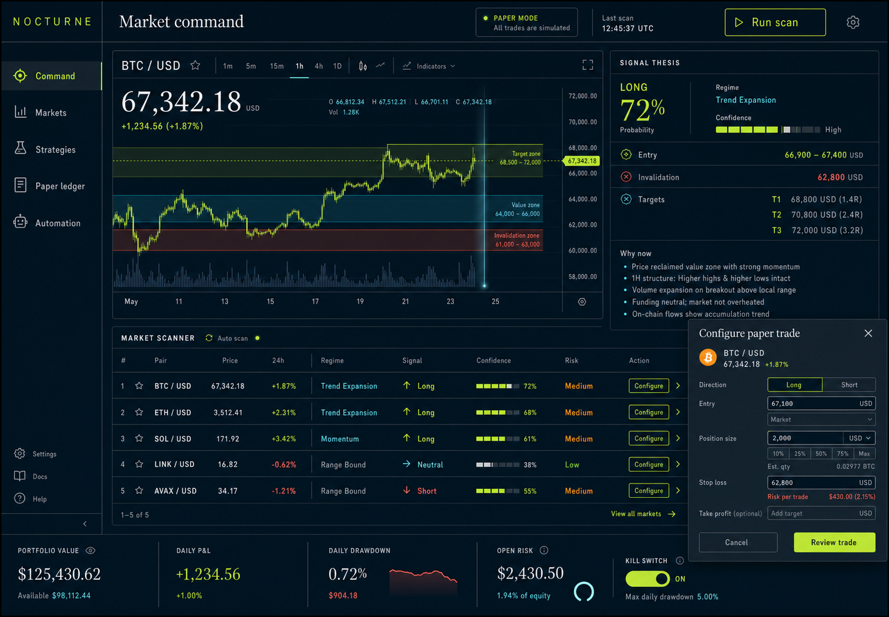

# NOCTURNE

An explainable crypto market scanner, backtester, paper-trading ledger, and safety-gated execution foundation. The dashboard is live-data capable and paper-first by design.

[Launch the free web app](https://daniel-techai.github.io/CryptoFuck/) · [Download the latest Actions app package](https://github.com/daniel-techAI/CryptoFuck/actions/workflows/app-package.yml) · [Set up Google/email profiles](docs/auth-and-deployment.md)

> This software is for research and simulation. Its probability values are heuristic ranking scores, not calibrated guarantees, and it is not financial advice. Crypto assets can lose substantial value.



## What is included

- Kraken public 1-hour OHLC scanner for BTC, ETH, SOL, LINK, and AVAX;
- closed-candle EMA20/50, RSI14, ATR14, momentum, and volume scoring;
- an evidence trail, regime, confidence, entry band, invalidation, and targets for every signal;
- factor contributions and 6h/12h signal memory so conviction changes are visible;
- walk-forward-style, fee-aware backtesting endpoint;
- persistent paper ledger with position sizing, open-risk caps, daily drawdown lock, and kill switch;
- a separately gated CCXT adapter for exchange sandbox/production execution;
- a responsive React/Vite command dashboard;
- an in-app strategy reality check, paper ledger, and local five-minute auto-scan control;
- an installable, offline-capable PWA with automatic browser-managed updates;
- optional Google/Gmail and passwordless email profiles through Supabase Auth;
- private cross-device paper accounts and preferences protected by row-level security;
- configurable high-conviction browser alerts for LONG/SHORT signals;
- CI, Dependabot, and a twice-hourly GitHub Pages data refresh/deployment workflow;
- a downloadable production app artifact built on every push to `main`;
- Docker deployment for the full API-backed mode.

## Why this architecture

The strongest existing systems split data, strategy, backtesting, execution, and monitoring instead of promising a magic predictor:

- [Freqtrade](https://github.com/freqtrade/freqtrade) provides dry-run trading, backtests, optimization, and adaptive FreqAI models.
- [Hummingbot](https://github.com/hummingbot/hummingbot) demonstrates standardized real-time exchange connectors and strategy execution.
- [CCXT](https://github.com/ccxt/ccxt) provides a unified API across more than 100 exchanges and sandbox switching where supported.
- [VectorBT](https://vectorbt.dev/) demonstrates fast research and parameter exploration.

NOCTURNE borrows their separation of concerns while keeping this first release small enough to audit. The near-term edge is not “predict perfectly”; it is consistent data handling, transparent ranking, realistic testing, and enforced risk.

## Quick start

Requires Node 22 or newer.

```bash
npm install
npm run scan
npm run dev
```

Open `http://127.0.0.1:5173`. The API runs on `http://127.0.0.1:8787`.

Profiles are optional. To enable them locally:

```bash
cp web/.env.example web/.env.local
```

Add the Supabase project URL and publishable key, then follow [profiles and deployment](docs/auth-and-deployment.md). Guests can use the full scanner and a private local paper ledger without an account.

```bash
npm test
npm run build
```

Container mode:

```bash
docker compose up --build
```

Then open `http://127.0.0.1:8787`.

## API

| Method | Path | Purpose |
| --- | --- | --- |
| `GET` | `/api/health` | Mode and service health |
| `POST` | `/api/scan` | Scan configured markets |
| `POST` | `/api/backtest` | Backtest one supported pair |
| `GET` | `/api/paper/portfolio` | Risk and paper portfolio state |
| `GET/POST` | `/api/paper/orders` | List or place paper orders |
| `POST` | `/api/paper/orders/:id/close` | Close a paper position |
| `POST` | `/api/kill-switch` | Block or allow new paper orders |
| `POST` | `/api/execution/orders` | Place a fully gated CCXT order |

## Automated updates

`.github/workflows/pages.yml` refreshes the market snapshot at minutes 17 and 47 of each hour, builds the dashboard, and deploys it with GitHub Pages Actions. The PWA service worker upgrades installed copies automatically. `.github/workflows/app-package.yml` builds a downloadable production artifact on every push to `main` and on manual dispatch.

Enable **Settings → Pages → Source: GitHub Actions** once after the first push. GitHub schedules can be delayed and may be disabled after 60 inactive days; see the [operations runbook](docs/risk-and-operations.md).

## Profiles and privacy

Google sign-in uses only OpenID, email, and basic profile scopes; it does not access Gmail messages. Email addresses stay in Supabase Auth and are not copied to public profile rows. Signed-in paper orders, account state, and alert preferences are owner-only through Postgres RLS. Users can permanently delete their cloud identity and all linked simulation data from the profile dialog.

Read the deployed [privacy policy](https://daniel-techai.github.io/CryptoFuck/privacy.html), [terms](https://daniel-techai.github.io/CryptoFuck/terms.html), and [security policy](SECURITY.md).

## Live execution

Read [risk and operations](docs/risk-and-operations.md) and [architecture](docs/architecture.md) first. The example environment intentionally leaves live execution disabled. Do not put exchange credentials into the frontend or GitHub Pages. Store them only in a private, monitored backend environment, and never grant withdrawal permission.

## Repository map

```text
server/   market data, signals, backtest, paper broker, live adapter, API
web/      React dashboard and static market snapshot
docs/     design system, architecture, and operations
.github/  CI, dependency updates, scheduled Pages deployment
supabase/ profile, RLS, and cloud paper-account migration
```

Released under the [MIT License](LICENSE).
