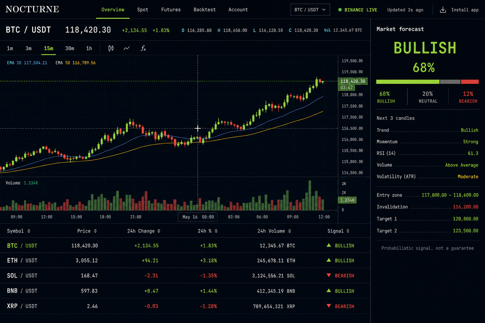

# NOCTURNE

A live Binance crypto market terminal with candlestick charts, transparent forecasts, cost-aware walk-forward validation, and risk-limited paper trading.

[Launch the free live web app](https://daniel-techai.github.io/CryptoFuck/) - [Download the latest app package](https://github.com/daniel-techAI/CryptoFuck/actions/workflows/app-package.yml) - [Set up Google/email profiles](docs/auth-and-deployment.md)

> Research and simulation only. Forecasts are probabilistic rule-based estimates, not guarantees or financial advice. Crypto can lose substantial value.



## Live web experience

- Binance Spot REST history plus reconnecting WebSocket market streams;
- a three-second UI refresh cadence with a visible event-age and connection indicator;
- selectable `1m`, `3m`, `15m`, `30m`, and `1h` candles;
- a real interactive candlestick chart with volume, EMA 20, EMA 50, targets, and invalidation;
- BTC/USDT, ETH/USDT, SOL/USDT, BNB/USDT, and XRP/USDT live market tape;
- explicit bullish, bearish, or neutral forecasts with probability distribution and indicator evidence;
- a hard neutral gate when walk-forward directional accuracy is weak;
- 15-minute and 1-hour context confirmation that lowers confidence on conflicts;
- separate Overview, Spot, Futures, Backtest, and Account workspaces;
- paper Spot and Futures order forms with estimated fees, slippage, risk, and liquidation;
- persistent browser-local paper positions, portfolio caps, and a kill switch;
- installable PWA behavior with automatic code updates;
- optional Google and email profiles through Supabase Auth.

Binance documents the public [Kline WebSocket stream](https://developers.binance.com/docs/binance-spot-api-docs/web-socket-streams) and [historical kline endpoint](https://developers.binance.com/docs/binance-spot-api-docs/rest-api/market-data-endpoints). No API key is needed for these public feeds.

## Forecast and validation boundary

NOCTURNE combines EMA structure, EMA slope, six-candle momentum, RSI 14, ATR 14, and volume confirmation into a bounded score. A forecast includes its horizon, evidence, entry zone, invalidation, targets, and a probability distribution.

The Backtest tab performs a rolling walk-forward check: every historical decision sees only data available at that candle, then evaluates the following three candles. Directional accuracy and net-positive outcomes after a modeled 0.24% round trip are shown separately. This is a reality check, not proof of future edge.

## Quick start

Requires Node 22 or newer.

```bash
npm install
npm run dev -w web
```

Open `http://127.0.0.1:5173`. The static web mode gets public market data directly from Binance and keeps paper activity in local browser storage.

To run the optional Express API and web app together:

```bash
npm run dev
```

Validation:

```bash
npm run check
npm audit --audit-level=moderate
```

## Profiles

Profiles are optional. Guests can use live charts, forecasts, backtests, and local paper trading without an account. To enable Google OAuth and email magic links, copy `web/.env.example` to `web/.env.local`, add a Supabase project URL and publishable key, apply the migration under `supabase/migrations`, and follow [profiles and deployment](docs/auth-and-deployment.md).

Google sign-in requests basic identity scopes only; it does not read Gmail messages. Cloud paper rows are owner-only through Postgres row-level security.

## Automated deployment and downloads

`.github/workflows/pages.yml` builds and deploys the live PWA whenever `main` changes. `.github/workflows/app-package.yml` produces a downloadable production artifact on every push to `main` and on manual dispatch. Installed copies use the service worker's automatic update path.

Market prices do not wait for GitHub Actions: each open app connects directly to the Binance public WebSocket and applies live events to the chart every three seconds.

## Execution safety

The public web app never sends exchange orders and never asks for exchange credentials. Paper limits include 1% maximum equity risk per trade, 3% total open risk, a 20% notional cap, and a kill switch.

The repository still contains a separately gated server-side CCXT adapter for private sandbox development. Never put exchange secrets into the frontend, GitHub Pages variables, or browser storage, and never grant withdrawal permission.

## Repository map

```text
web/       live Binance client, chart, forecast, validation, tabs, PWA, profiles
server/    optional API, Kraken scanner, paper broker, backtest, gated CCXT adapter
supabase/  profile, RLS, and cloud paper-account migration
docs/      architecture, authentication, risk, and operations
.github/   CI, Pages deployment, packages, and dependency updates
```

Released under the [MIT License](LICENSE).
