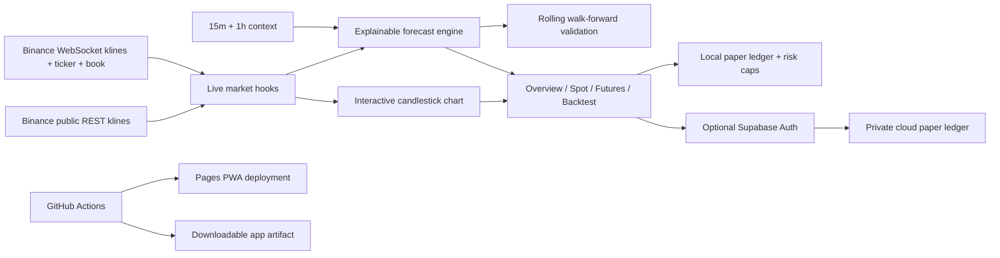

# Architecture

## Live market boundary

The static Pages app requests up to 360 historical candles from Binance's public market-data REST endpoint. It then opens one combined stream for the selected symbol's kline, 24-hour ticker, and best bid/ask, plus one combined mini-ticker stream for the five-row market tape.

Binance pushes non-1s kline updates approximately every two seconds. Incoming frames update refs without forcing React to render for every event; the visible UI flushes every three seconds. The header reports the most recent event age, reconnects with exponential backoff, and switches to an offline or reconnecting state rather than labeling old data live.

## Forecast boundary

The deterministic client-side model uses:

- EMA 20/50 spread, price location, and EMA slope;
- six-candle price momentum;
- RSI 14 with exhaustion penalties;
- ATR 14 volatility;
- current volume relative to a 20-candle baseline.

Absolute scores below 18 are neutral. Rolling validation replays historical decisions without look-ahead over a three-candle horizon. Directional accuracy is separated from net-positive outcomes after a modeled 0.24% round trip. A sample with directional accuracy below 48% cannot publish a directional call. Fifteen-minute and one-hour context can further reduce confidence when the active timeframe conflicts.

This is an explainable heuristic, not a trained predictive model or calibrated probability of profit.

## Paper execution boundary

Spot and Futures tabs are simulations. The cost panel models taker fees and slippage, and the Futures tab estimates liquidation without pretending to reproduce every Binance maintenance tier or funding payment. Actual account fees vary.

The local and cloud paper broker boundaries retain these portfolio limits:

- 1% maximum equity risk per trade;
- 3% maximum total open risk;
- 20% maximum position notional;
- an immediate kill switch.

The server-side `LiveBroker` remains separate and disabled by default. It requires explicit server environment gates, an arm token, per-order acknowledgement, configured equity, and sandbox mode unless the production-loss acknowledgement is present. Exchange secrets are prohibited from the web build.

## Identity and deployment boundary

Supabase is lazy and optional. Guests never contact the profile database. Signed-in paper accounts use owner-scoped RLS and security-definer risk functions. The browser receives only a Supabase publishable key.

GitHub Pages deploys on changes to `main`; live prices come directly from Binance and do not depend on scheduled repository rebuilds. The PWA service worker automatically replaces old code bundles after a successful deployment.
