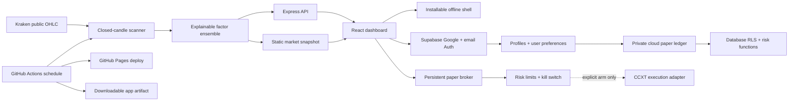

# Architecture

## Signal pipeline

The scanner requests up to 720 Kraken OHLC rows and explicitly drops the final, not-yet-committed candle. It calculates EMA20/50, RSI14, ATR14, 24-hour momentum, and a 20-hour volume baseline. Those factors produce a bounded score from -100 to +100. The UI labels the derived value a probability score; it is a ranking heuristic, not a statistically calibrated chance of profit.

Every result includes the raw indicators, five evidence statements, a regime label, entry band, ATR-derived invalidation, and three risk/reward targets. If a market request fails, that pair is replaced by deterministic offline sample data and the entire snapshot is visibly marked stale.

## Execution boundary

`PaperBroker` is the default and persists an append-only-style order list plus account state to an atomic JSON file. It enforces:

- 1% maximum equity risk per trade;
- 3% maximum total open risk;
- 20% maximum position notional;
- 3% maximum daily drawdown;
- an immediate kill switch.

`LiveBroker` is a separate, lazily loaded CCXT boundary. It requires `LIVE_TRADING_ENABLED=true`, exchange credentials, `LIVE_ACCOUNT_EQUITY_USD`, an arm-token header, and a verbatim per-order acknowledgement. It rejects risk above 1% of configured equity and rejects markets where CCXT does not advertise an attached stop-loss feature. Unless `LIVE_PRODUCTION_ACK=YES_I_ACCEPT_REAL_LOSS_RISK` is also present, it requests the exchange sandbox before any other exchange call.

## Identity and storage boundary

Supabase is optional and lazy-loaded. Guests never contact the profile database and keep simulation data in browser storage. Signed-in users use Google OAuth or passwordless email; emails remain in `auth.users`, while the public profile table contains only ID, optional handle, display name, and avatar URL. Paper accounts, orders, and preferences use owner-scoped RLS policies. Order placement and the kill switch execute in security-definer database functions that re-check identity and risk limits atomically.

The browser receives only a Supabase publishable key. Service-role keys, Google client secrets, exchange secrets, and trading-arm tokens are prohibited from frontend builds and GitHub Pages variables.

## Deployment modes

- GitHub Pages: installable PWA with a scheduled read-only live/cached scanner. Guests use a browser-local paper ledger; authenticated users may sync private simulation data through Supabase. The workflow refreshes market data every 30 minutes and deploys without committing generated snapshots back into Git history.
- Container/API: full scanning, server-persisted paper ledger, backtesting, and the gated execution adapter.
