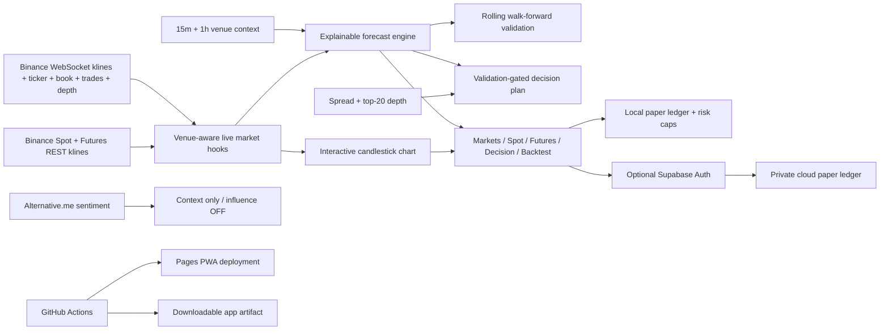

# Architecture

## Live market boundary

The static Pages app requests up to 360 historical candles from Binance's public Spot or USDⓈ-M Futures market-data endpoint. Spot, Markets, Decision and Backtest default to EUR and can switch to USDT or USDC. Futures uses a separate USDT/USDC preference because Binance does not list EUR perpetual contracts. The app opens one combined stream for the selected venue's kline, 24-hour ticker, and best bid/ask. Spot and Futures workspaces also open independent venue-matched top-20 depth and recent-trade streams, so one reconnect does not interrupt both panels. The Markets tab retains a separate combined Spot mini-ticker stream for its five-row tape.

Binance pushes non-1s kline updates approximately every two seconds. Kline/ticker frames update refs without forcing React to render for every event; the visible market UI flushes every three seconds. Depth and recent trades use a separate 500ms render cadence and only connect while Spot, Futures, or Decision is open. The header reports event age, reconnects with exponential backoff, and switches to an offline or reconnecting state rather than labeling old data live.

## Decision boundary

The Decision workspace wraps the forecast in explicit reliability gates. A new directional setup is blocked unless data is live and at most ten seconds old, walk-forward validation has at least 20 observations with at least 50% directional accuracy and 25% net-positive outcomes after modeled costs, higher timeframes do not conflict, the bid/ask spread is at most eight basis points, direction is non-neutral, and Target 1 offers at least 1.2R after costs.

The user can declare a manual position context (`none`, `long`, or `short`) because the public app is not connected to a real Binance account. Existing-position plans can then return `MANAGE`, `REDUCE`, or `EXIT`. The stretch level is an ATR extension, not a predicted maximum.

Alternative.me sentiment and external official/editorial/community links appear only in the factual context ledger. They do not modify probabilities or directional scores. Community content is explicitly labeled unverified.

## Forecast boundary

The deterministic client-side model uses:

- EMA 20/50 spread, price location, and EMA slope;
- six-candle price momentum;
- RSI 14 with exhaustion penalties;
- ATR 14 volatility;
- current volume relative to a 20-candle baseline.

Absolute scores below 18 are neutral. Rolling validation replays historical decisions without look-ahead over a three-candle horizon. Directional accuracy is separated from net-positive outcomes after a modeled 0.24% round trip. A sample with directional accuracy below 48% cannot publish a directional call. Fifteen-minute and one-hour context can further reduce confidence when the active timeframe conflicts.

This is an explainable heuristic, not a trained predictive model or calibrated probability of profit.

## Paper execution boundary

Spot and Futures tabs are simulations. Each venue uses its matching public Binance chart, ticker, depth, and aggregate-trade stream. The order ticket models taker fees and slippage, and the Futures tab adds public mark/funding context plus an educational liquidation estimate without pretending to reproduce every Binance maintenance tier or funding payment. Actual account fees vary.

The local and cloud paper broker boundaries retain these portfolio limits:

- 1% maximum equity risk per trade;
- 3% maximum total open risk;
- 20% maximum position notional;
- an immediate kill switch.

The server-side `LiveBroker` remains separate and disabled by default. It requires explicit server environment gates, an arm token, per-order acknowledgement, configured equity, and sandbox mode unless the production-loss acknowledgement is present. Exchange secrets are prohibited from the web build.

## Identity and deployment boundary

Supabase is lazy and optional. Guests never contact the profile database. Signed-in paper accounts use owner-scoped RLS and security-definer risk functions. The browser receives only a Supabase publishable key.

GitHub Pages deploys on changes to `main`; live prices come directly from Binance and do not depend on scheduled repository rebuilds. The PWA service worker automatically replaces old code bundles after a successful deployment.
